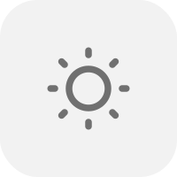
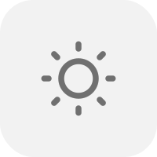
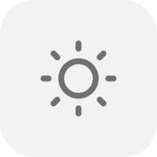
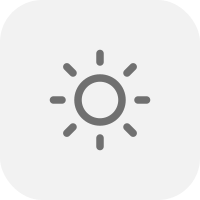
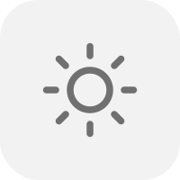
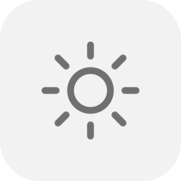
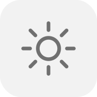
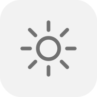
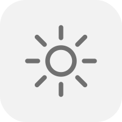

## 20 Sun SVGs for Brightness UI

A collection of 20 scalable sun SVG icons representing different brightness levels, inspired by macOS. Perfect for UI sliders, apps, or custom brightness indicators.
|  |  |  |  |
|-----------------------------|-----------------------------|-----------------------------|-----------------------------|
|  |  |  |  |
|  |  |  |  |
|  |  |  |  |
|  |  |  |  |

License

MIT License – free to use, modify, and distribute.
